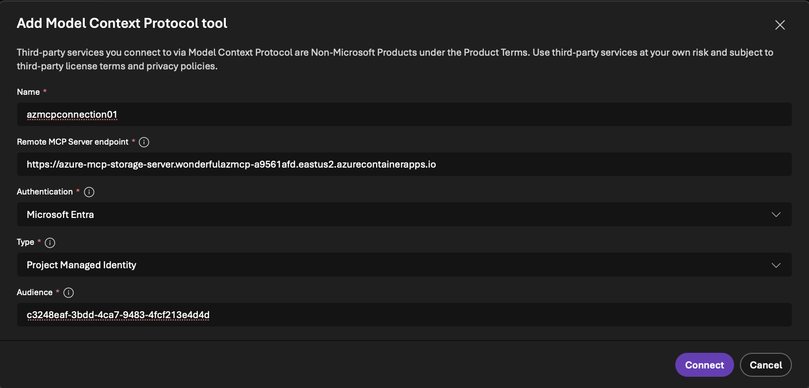

# Azure MCP Server - ACA with Managed Identity

This template deploys the [Azure MCP Server](https://mcr.microsoft.com/product/azure-sdk/azure-mcp) as a remote MCP server on Azure Container Apps, accessible over HTTPS. AI agents from [Microsoft Foundry](https://azure.microsoft.com/products/ai-foundry) and [Microsoft Copilot Studio](https://www.microsoft.com/microsoft-copilot/microsoft-copilot-studio) can securely invoke MCP tool calls to perform Azure operations on your behalf.

The template supports multiple **deployment scenarios** via separate parameter files. Namespaces are enabled automatically based on which resource IDs you provide.

## Prerequisites

- Azure subscription with **Owner** or **User Access Administrator** permissions
- [Azure Developer CLI (azd)](https://learn.microsoft.com/azure/developer/azure-developer-cli/install-azd)
- A [Microsoft Foundry](https://ai.azure.com) project (you'll need its Azure resource ID)
- The Azure MCP Server [command reference](https://github.com/Azure/azure-mcp/blob/main/docs/azmcp-commands.md) lists all available tool namespaces

## Deployment Scenarios

### Scenario 1: Storage (original)

Deploys with the `storage` namespace for read-only Azure Storage tools.

**Requires:** A Storage Account

```bash
copy infra\main.parameters.storage.json infra\main.parameters.json
azd env new mcp-storage
azd env set STORAGE_RESOURCE_ID "/subscriptions/{sub}/resourceGroups/{rg}/providers/Microsoft.Storage/storageAccounts/{name}"
azd up
```

**RBAC granted:** Reader + Storage Blob Data Reader on the storage account.

### Scenario 2: Monitor / Sentinel (security copilot)

Deploys with the `monitor` namespace for querying Log Analytics workspaces via KQL. This is the primary path for a **security copilot** that reacts to Sentinel and Defender alerts — Sentinel data lives in Log Analytics.

**Requires:** A Log Analytics workspace (with Sentinel enabled if you want security tables)

```bash
copy infra\main.parameters.monitor.json infra\main.parameters.json
azd env new mcp-sentinel
azd env set LOG_ANALYTICS_RESOURCE_ID "/subscriptions/{sub}/resourceGroups/{rg}/providers/Microsoft.OperationalInsights/workspaces/{name}"
azd up
```

**RBAC granted (subscription-scoped):** Reader + Log Analytics Reader + Microsoft Sentinel Reader. Subscription-level scope allows querying logs for any resource via `monitor resource log query` as well as workspace-level queries.

**Available MCP tools:**
- `azmcp monitor workspace list` — list workspaces
- `azmcp monitor table list` — list tables (SecurityAlert, SecurityIncident, Syslog, etc.)
- `azmcp monitor workspace log query` — run KQL queries against Sentinel tables

**Example agent prompts:**
- "Show me the latest 10 Sentinel security alerts"
- "Query SecurityIncident for high-severity incidents in the last 24 hours"
- "Summarise the CommonSecurityLog entries from the last hour"

### Scenario 3: Kusto / Azure Data Explorer

Deploys with the `kusto` namespace for querying ADX clusters directly.

**Requires:** An Azure Data Explorer cluster

```bash
copy infra\main.parameters.kusto.json infra\main.parameters.json
azd env new mcp-kusto
azd env set KUSTO_RESOURCE_ID "/subscriptions/{sub}/resourceGroups/{rg}/providers/Microsoft.Kusto/clusters/{name}"
azd up
```

**RBAC granted:** Reader + AllDatabasesViewer on the ADX cluster.

**Available MCP tools:**
- `azmcp kusto cluster list/get` — list or inspect clusters
- `azmcp kusto database list` — list databases
- `azmcp kusto table list/schema` — list tables and schemas
- `azmcp kusto query` — run KQL queries
- `azmcp kusto sample` — sample table data

### Scenario 4: Monitor + Kusto (combined)

Deploys with both `monitor` and `kusto` namespaces for full security analytics — query Sentinel via Log Analytics and ADX clusters in a single MCP server.

**Requires:** A Log Analytics workspace AND an Azure Data Explorer cluster

```bash
copy infra\main.parameters.monitor-kusto.json infra\main.parameters.json
azd env new mcp-security
azd env set LOG_ANALYTICS_RESOURCE_ID "/subscriptions/{sub}/resourceGroups/{rg}/providers/Microsoft.OperationalInsights/workspaces/{name}"
azd env set KUSTO_RESOURCE_ID "/subscriptions/{sub}/resourceGroups/{rg}/providers/Microsoft.Kusto/clusters/{name}"
azd up
```

**RBAC granted:** All roles from Scenarios 2 and 3 combined.

## What Gets Deployed

All scenarios deploy the same core infrastructure:

- **Container App** — Runs Azure MCP Server with the enabled namespace(s)
- **Role Assignments** — Container App managed identity granted read-only roles on the target resource(s), conditional on which namespaces are enabled
- **Entra App Registration** — OAuth 2.0 authentication with `Mcp.Tools.ReadWrite.All` role, assigned to the Foundry project's managed identity
- **Application Insights** — Telemetry and monitoring (disabled by default in the parameter files, set `appInsightsConnectionString` to `""` to enable)

### Deployment Outputs

After deployment, retrieve `azd` outputs:

```bash
azd env get-values
```

Key values for connecting your Foundry agent:

```
CONTAINER_APP_URL="https://azure-mcp-sentinel-server.<env>.eastus2.azurecontainerapps.io"
ENTRA_APP_CLIENT_ID="<your-app-client-id>"
```

## Using Azure MCP Server from Microsoft Foundry Agent

Once deployed, connect your Microsoft Foundry agent to the Azure MCP Server running on Azure Container Apps. The agent will authenticate using its managed identity and gain access to the configured tools.

1. Get your Container App URL from `azd` output: `CONTAINER_APP_URL`
2. Get Entra App Client ID from `azd` output: `ENTRA_APP_CLIENT_ID`
3. Navigate to your Foundry project: https://ai.azure.com/nextgen
4. Go to **Build** → **Create agent**
5. Select the **+ Add** in the tools section
6. Select the **Custom** tab
7. Choose **Model Context Protocol** as the tool and click **Create** 
8. Configure the MCP connection 
   - Enter the `CONTAINER_APP_URL` value as the Remote MCP Server endpoint
   - Select **Microsoft Entra** → **Project Managed Identity** as the authentication method
   - Enter your `ENTRA_APP_CLIENT_ID` as the audience
   - Click **Connect** to associate this connection to the agent

Your agent is now ready to assist you! It can answer your questions and leverage tools from the Azure MCP Server to perform Azure operations on your behalf.

## Example Agent Prompts
When using Azure MCP tools, always use these values:
- subscription: {AZURE_SUBSCRIPTION_ID}
- tenant: {AZURE_TENANT_ID}
- The Log Analytics workspace is {LOG_ANALYTICS_RESOURCE_ID} in resource group {AZURE_RESOURCE_GROUP}
 
Do not ask the user for these values or list these in your output. Use them automatically for all MCP tool calls.

## Clean Up

```bash
azd down
```

## Template Structure

The `azd` template consists of the following Bicep modules:

- **`main.bicep`** — Orchestrates deployment; conditionally enables namespaces and RBAC based on which resource IDs are provided
- **`aca-infrastructure.bicep`** — Deploys Container App hosting the Azure MCP Server
- **`aca-role-assignment-resource-storage.bicep`** — Assigns storage RBAC roles (Reader + Storage Blob Data Reader)
- **`aca-role-assignment-resource-kusto.bicep`** — Assigns ADX RBAC roles (Reader + AllDatabasesViewer)
- **`aca-role-assignment-resource-loganalytics.bicep`** — Assigns Log Analytics RBAC roles (Reader + Log Analytics Reader + Microsoft Sentinel Reader)
- **`entra-app.bicep`** — Creates Entra App registration with custom app role for OAuth 2.0 authentication
- **`foundry-role-assignment-entraapp.bicep`** — Assigns Entra App role to the Foundry project's managed identity
- **`application-insights.bicep`** — Deploys Application Insights for telemetry and monitoring (conditional)

### Parameter Files

| File | Namespaces | Use Case |
|------|-----------|----------|
| `main.parameters.storage.json` | `storage` | Azure Storage tools |
| `main.parameters.monitor.json` | `monitor` | Sentinel / Log Analytics KQL queries |
| `main.parameters.kusto.json` | `kusto` | Azure Data Explorer queries |
| `main.parameters.monitor-kusto.json` | `monitor` + `kusto` | Combined security analytics |

> **Note:** Copy the desired parameter file to `main.parameters.json` before running `azd up`. The `azd` CLI reads `infra/main.parameters.json` by convention.

## Testing on an Empty Subscription

For the **Monitor/Sentinel** scenario on a fresh subscription:

1. Create a resource group
2. Create a Log Analytics workspace (free tier is fine)
3. Enable Microsoft Sentinel on the workspace (Azure Portal → Sentinel → Add workspace)
4. Create a Microsoft Foundry project at [ai.azure.com](https://ai.azure.com)
5. Deploy with `main.parameters.monitor.json`
6. Sentinel will auto-populate tables like `SecurityAlert`, `SecurityIncident`, `Heartbeat` once data connectors are configured
